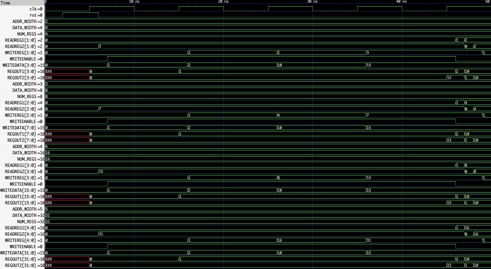

# Parameterized Register File

A synthesizable SystemVerilog register file whose width and depth are selected at elaboration time. The design provides two independent asynchronous read ports and one synchronous write port, making it a compact RTL building block for datapaths and processor-style designs.

The same RTL is verified with a single generic testbench in four configurations: **4×4**, **8×8**, **16×16**, and **32×32**.

## Overview

This project demonstrates reusable RTL through parameterization. Instead of maintaining separate register-file implementations for each size, `DATA_WIDTH` and `NUM_REGS` determine the storage dimensions, while the address width is derived automatically with `$clog2(NUM_REGS)`.

## Features

- Parameterized data width and number of registers
- Two independent combinational (asynchronous) read ports
- One synchronous write port
- Active-high `WRITEENABLE`
- Synchronous reset
- Address width derived automatically from register count
- One reusable testbench for 4×4, 8×8, 16×16, and 32×32 instances
- VCD dump and GTKWave waveform inspection

## Block Diagram


The register array has two read-address inputs, each producing its own read-data output. A write is performed on the active clock edge when `WRITEENABLE` is asserted.

## Interface / Ports

| Port | Direction | Width | Description |
|---|---|---:|---|
| `clk` | Input | 1 | Clock for synchronous write and reset operations. |
| `rst` | Input | 1 | Synchronous reset. |
| `READREG1` | Input | `ADDR_WIDTH` | Address for read port 1. |
| `READREG2` | Input | `ADDR_WIDTH` | Address for read port 2. |
| `WRITEREG` | Input | `ADDR_WIDTH` | Destination register address for writes. |
| `WRITEDATA` | Input | `DATA_WIDTH` | Data written to `WRITEREG`. |
| `WRITEENABLE` | Input | 1 | Active-high write enable. |
| `REGOUT1` | Output | `DATA_WIDTH` | Combinational read data from `READREG1`. |
| `REGOUT2` | Output | `DATA_WIDTH` | Combinational read data from `READREG2`. |

## Parameters

| Parameter | Meaning |
|---|---|
| `DATA_WIDTH` | Number of bits stored in each register. |
| `NUM_REGS` | Number of registers in the file. |
| `ADDR_WIDTH` | Local parameter derived as `$clog2(NUM_REGS)`. |

For example, a 32×32 instance stores 32-bit values in 32 registers and uses 5-bit addresses:

```systemverilog
register_file #(
    .DATA_WIDTH(32),
    .NUM_REGS  (32)
) dut (...);
```

## How It Works

The read ports are combinational: changing `READREG1` or `READREG2` updates `REGOUT1` or `REGOUT2` without waiting for a clock edge. This permits two register values to be observed independently in the same cycle.

Writes are synchronous. On the active clock edge, when `WRITEENABLE` is high, `WRITEDATA` is stored at the location selected by `WRITEREG`. Reset is also sampled synchronously on the clock.

## Verification

A parameterized testbench instantiates the same test logic for the following configurations:

| Configuration | `DATA_WIDTH` | `NUM_REGS` | `ADDR_WIDTH` |
|---|---:|---:|---:|
| 4×4 | 4 | 4 | 2 |
| 8×8 | 8 | 8 | 3 |
| 16×16 | 16 | 16 | 4 |
| 32×32 | 32 | 32 | 5 |

This verifies that the storage width and address sizing scale correctly from the same RTL and testbench source.

## Simulation / Tools

The design is simulated as SystemVerilog. The testbench generates a VCD waveform file, which can be inspected in GTKWave to observe reset, clocked writes, read addresses, write data, write enable, and both read outputs.

Typical flow:

1. Compile the register-file RTL and generic testbench with a SystemVerilog simulator.
2. Run the simulation to generate the VCD output.
3. Open the VCD file in GTKWave.
4. Inspect each parameterized instance and confirm its address and data widths.

## Repository Structure

```text
.
├── register_file.s       # Parameterized register-file RTL
├── tb_register_file.s    # Generic multi-configuration testbench
├── diagram.png           # Register-file block diagram
├── waveform.png          # GTKWave verification capture
└── README.md
```

## Waveform



The waveform shows the four test configurations operating with their corresponding signal widths. It is particularly useful for confirming that `$clog2(NUM_REGS)` produces the expected address width for every instance.

## Future Improvements

- Add self-checking assertions or a scoreboard to automatically validate read and write behavior.
- Add randomized address and data stimulus.
- Add coverage metrics for reset, write-enable, register-address, and read-port scenarios.
- Extend the verification environment with constrained-random or UVM-based testing.
- Evaluate synthesis results for selected FPGA or ASIC technology libraries.
